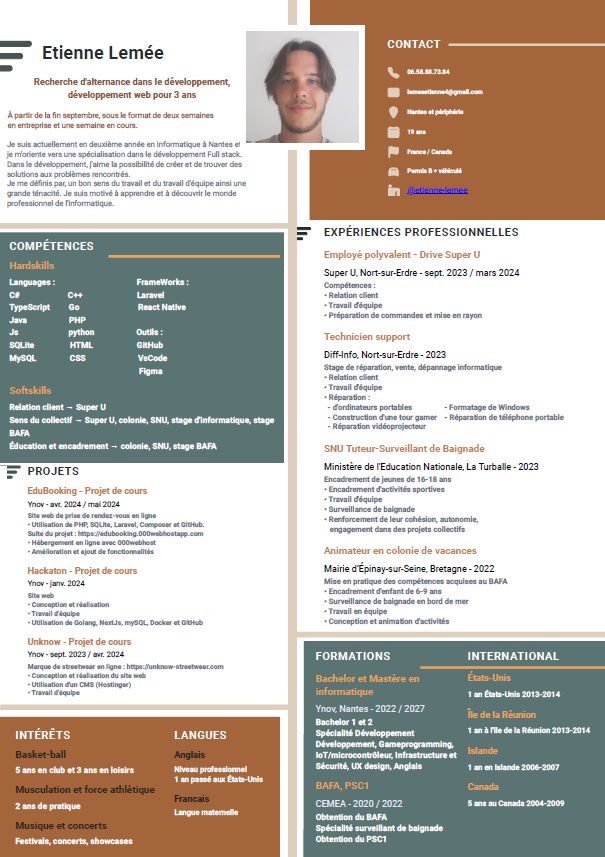

# Portfolio
## Etienne Lemée, B2 à Ynov Nantes

### Table des Matières :
1. [Languages et Frameworks](#1-languages-et-frameworks)
2. [CV](#2-cv)
3. [Projet EduBooking](#3-projet-edubooking)
4. [Cours d'UX Design](#4-cours-dux-design)
5. [Projet Ydays B2 "UNKNOW"](#5-projet-ydays-b2-unknow)
6. [Projet Ydiscover B2 “WebMusYc”](#6-projet-ydiscover-b2-webmusyc)
7. [Projet GameProgramming "GraveBound"](#7-projet-gameprogramming-gravebound)
8. [Contacts](#8-contacts)

---

## 1. Languages et Frameworks

### Langages de Programmation :
- 
- 
- 
- 
- 
- 
- 
- 

### Frameworks :
- 
- 

---

## 2. CV

---

## 3. Projet EduBooking
**Description du Projet :** Création d'une application avec du machine to machine, une utilisation des informations du monde physique, une BDD, un algorithme avancé, de l’interaction avec l’utilisateur, un CRUD. Je poursuis activement le projet dans le but d'approfondir mes compétences en développement. J'applique l'ensemble des connaissances acquises tout au long des divers modules de cours, notamment en ce qui concerne l'accessibilité, l'expérience utilisateur (UX) et le langage SQL.

- **Lien vers le site web :** [EduBooking](https://edubooking.000webhostapp.com)
- **Documentation Readme :** [GitHub](https://github.com/EtienneLm/Projet-EduBooking-B2)
- **Gestion de Projet :** [Tableau Kaban](https://github.com/users/EtienneLm/projects/2)

---

## 4. Cours d'UX Design
**Description du Projet :** Appliquer les connaissances acquises lors des cours : Maquette, persona, questionnaire 
- **Lien vers la maquette :** [Figma](https://www.figma.com/design/CslSiGrZHYO7bjdchYZAUi/Ynov-UX-Projet-FreePrints?node-id=1-378&t=pl1rD0o81aj0NBFE-0)

---

## 5. Projet Ydays B2 "UNKNOW"
**Description du Projet :** Site web de vente de vêtements streetwear, créé avec le CMS Hostinger. Projet fil rouge de ma deuxième année, réalisé en collaboration avec des élèves de différentes filières de l’école.
- **Lien vers le site web :** [UNKNOW Streetwear](https://unknow-streetwear.com)
- **Démonstration du Produit :** 

---

## 6. Projet Ydiscover B2 “WebMusYc”
**Description du Projet :** *Projet non achevé*. Création d'un site web permettant la génération de playlists et des blindtests, utilisant l'API Spotify.
- **Lien vers le site web (local) :** [WebMusYc](http://127.0.0.1:5000/home)  
  

---

## 7. Projet GameProgramming "GraveBound"
**Description du Projet :** "GraveBound" est un projet de jeu vidéo développé en C# sur Unity dans le cadre du cours de Game Programming. C'est un jeux d'aventure et de survie.
- **Lien vers la vidéo de gameplay :** [Visionner la vidéo de gameplay](https://youtu.be/Pn65kcbow58?si=G3FcakucEF9RHi8t)

---

## 8. Contacts
- **Email :** lemeeetienne4@gmail.com
- **Téléphone :** 06 58 88 73 84
- **LinkedIn :** [Etienne Lemée](https://www.linkedin.com/in/etienne-lemee/)
