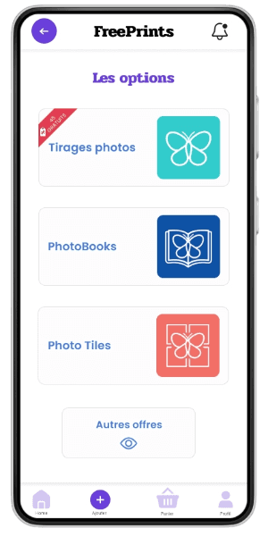
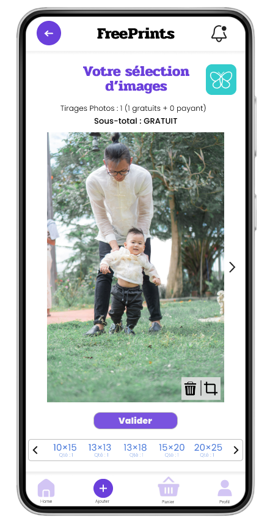

# Portfolio
## Etienne Lemée, B2 à Ynov Nantes

### Table des Matières :
1. [Langages et Frameworks](#1-Langages-et-frameworks)
2. [CV](#2-cv)
3. [Projet EduBooking](#3-projet-edubooking)
4. [Cours d'UX Design](#4-cours-dux-design)
5. [Projet Ydays B2 "UNKNOW"](#5-projet-ydays-b2-unknow)
6. [Projet Ydiscover B2 “WebMusYc”](#6-projet-ydiscover-b2-webmusyc)
7. [Projet GameProgramming "GraveBound"](#7-projet-gameprogramming-gravebound)
8. [Projet IoT "Poubellator2000"](#8-projet-iot-poubellator2000)
9. [Projet Game "AstroBird"](#9-projet-game-astrobird)
10. [Contacts](#10-contacts)

---

## 1. Langages et Frameworks

### Langages de Programmation :
- 
- 
- 
- 
- 
- 
- 
- 

### Frameworks :
- 
- 

---

## 2. CV

---

## 3. Projet EduBooking
**Langages et Technologies Utilisés :**
    

**Description du Projet :** Création d'une application avec du machine to machine, une utilisation des informations du monde physique, une BDD, un algorithme avancé, de l’interaction avec l’utilisateur, un CRUD. Je poursuis activement le projet dans le but d'approfondir mes compétences en développement. J'applique l'ensemble des connaissances acquises tout au long des divers modules de cours, notamment en ce qui concerne l'accessibilité, l'expérience utilisateur (UX) et le langage SQL.

- **Lien vers le site web :** [EduBooking](https://edubooking.000webhostapp.com)
- **Documentation Readme :** [GitHub](https://github.com/EtienneLm/Projet-EduBooking-B2)
- **Gestion de Projet :** [Tableau Kaban](https://github.com/users/EtienneLm/projects/2)

---

## 4. Cours d'UX Design
**Langages et Technologies Utilisés :**

**Description du Projet :** Appliquer les connaissances acquises lors des cours : Maquette, persona, questionnaire 
- **Lien vers la maquette :** [Figma](https://www.figma.com/design/CslSiGrZHYO7bjdchYZAUi/Ynov-UX-Projet-FreePrints?node-id=1-378&t=pl1rD0o81aj0NBFE-0)
- **Démonstration du Produit :**

 

---

## 5. Projet Ydays B2 "UNKNOW"
**Langages et Technologies Utilisés :**

**Description du Projet :** Site web de vente de vêtements streetwear, créé avec le CMS Hostinger. Projet fil rouge de ma deuxième année, réalisé en collaboration avec des élèves de différentes filières de l’école.
- **Lien vers le site web :** [UNKNOW Streetwear](https://unknow-streetwear.com)
- **Démonstration du Produit :** 

---

## 6. Projet Ydiscover B2 “WebMusYc”
**Langages et Technologies Utilisés :**
   

**Description du Projet :** *Projet non achevé*. Création d'un site web permettant la génération de playlists et de blindtests, en utilisant l'API Spotify.  

---

## 7. Projet GameProgramming "GraveBound"
**Langages et Technologies Utilisés :**
 

**Description du Projet :** "GraveBound" est un projet de jeu vidéo développé en C# sur Unity dans le cadre du cours de Game Programming. C'est un jeux d'aventure et de survie.
- **Lien vers la vidéo de gameplay :** [Vidéo YouTube](https://youtu.be/Pn65kcbow58?si=G3FcakucEF9RHi8t)

---

## 8. Projet IoT "Poubellator2000"
**Langages et Technologies Utilisés :**

**Description du Projet :** Le "Poubellator2000" est une boîte intelligente qui s'ouvre et se ferme grâce à un capteur de proximité. Il indique également son niveau de remplissage à l'aide de capteurs, utilisant des LED de différentes couleurs pour une indication visuelle.

- **Lien vers la vidéo de démonstration :** [Vidéo YouTube](https://youtube.com/shorts/_9lEEj-H3SE?feature=share)

---

## 9. Projet Game "AstroBird"
**Langages et Technologies Utilisés :**
  

**Description du Projet :** "AstroBird" est un jeu inspiré de Flappy Bird, mais avec un thème spatial. Développé dans le cadre d'un projet de cours lors de ma première année d'études. Les graphismes ont été spécialement créés pour le projet afin de donner vie à son univers spatial.

- **Lien vers la vidéo de présentation :** [Vidéo YouTube](https://youtu.be/gxBz-4nGVCc)

---

## 10. Contacts
- **Email :** lemeeetienne4@gmail.com
- **Téléphone :** 06 58 88 73 84
- **LinkedIn :** [Etienne Lemée](https://www.linkedin.com/in/etienne-lemee/)
