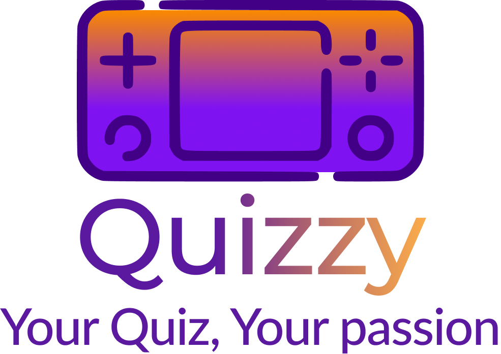
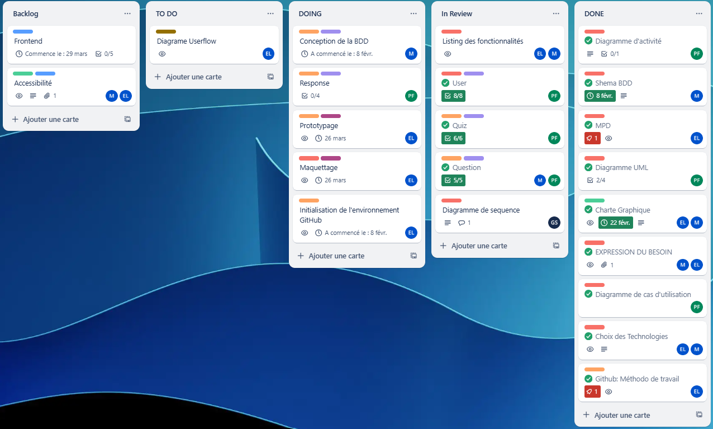
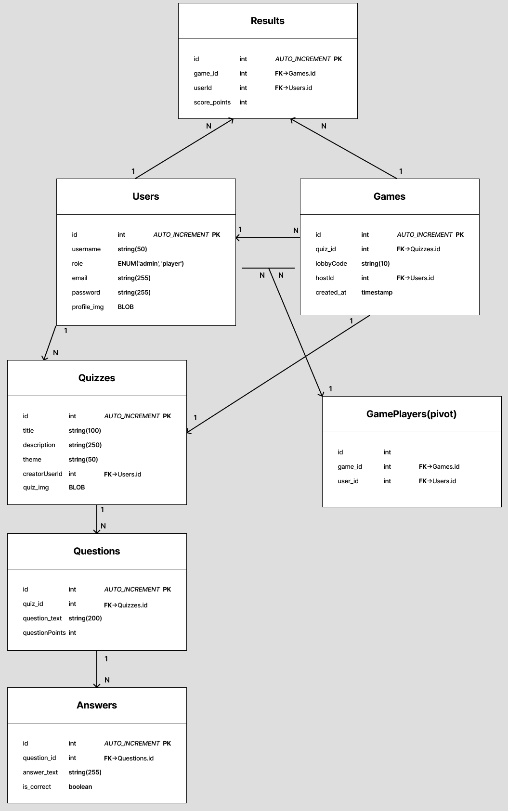
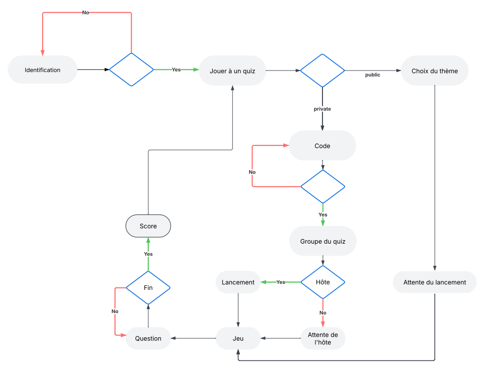
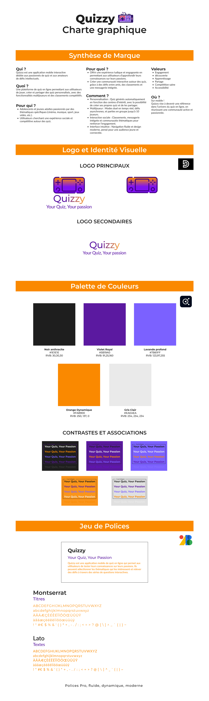
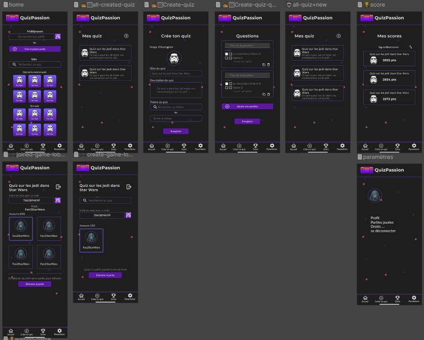
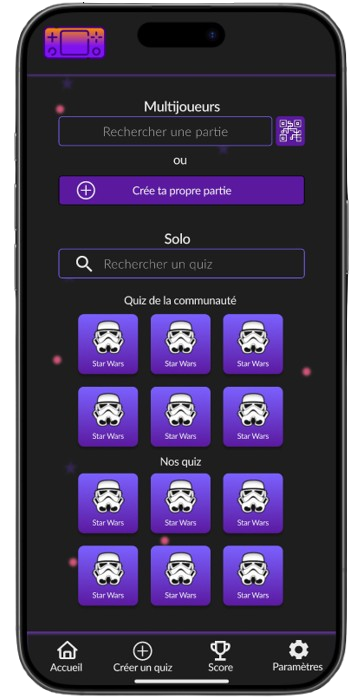

# Quizzy - B3 Suivi de Projet  

## Langages et Technologies Utilisés  
| Langages et Technologies |  |
|------------|-------|
|  |  |
|  |  |
|  |  |
|  |  |
|  |  |

---

## Description du Projet  
Ce projet vise à **offrir une expérience professionnelle** proche de la réalité du terrain et construire un projet qui couvre l’ensemble des **points de compétence du référentiel RNCP**.  
Notre idée : créer une plateforme permettant aux utilisateurs de **se rassembler autour de leurs passions** grâce à plusieurs modes de jeu :  
🎮 **Quiz Multijoueur** | 🏆 **Quiz Solo**

---

## Organisation  
Utilisation de **Trello** pour la gestion de projet.   

---

## Diagrammes  

### Modèle Physique de Données

### Diagramme d'Activité (User)  

---

##  Charte Graphique  
**Charte graphique** complète de **Quizzy**  

---

## Maquettage & Prototypage  
**Lien vers la maquette Figma :**  [Voir la maquette](https://www.figma.com/design/PzlJKUFo3R4SECfjWpKPgd/Quizzy-Proj-fil_rouge?node-id=107-1011&t=ewXKWvwXB5dk65k9-0)  

**Vu d'ensemble** des maquettes de l'application  
  
  
**Page d'accueil** de l'application, vue sur Figma  

---

## Backend  
### API  
  

---

## Frontend  
  
