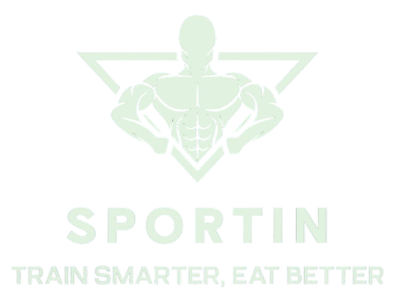
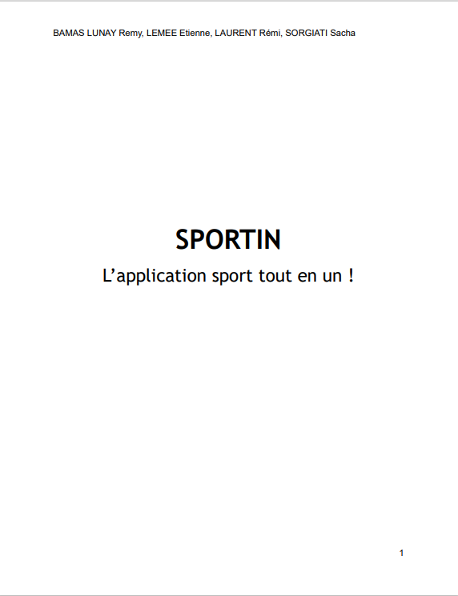
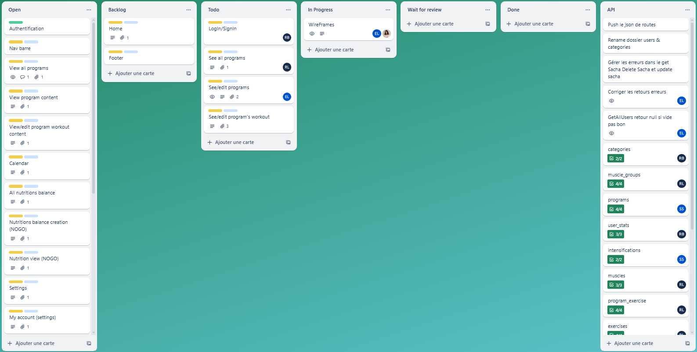
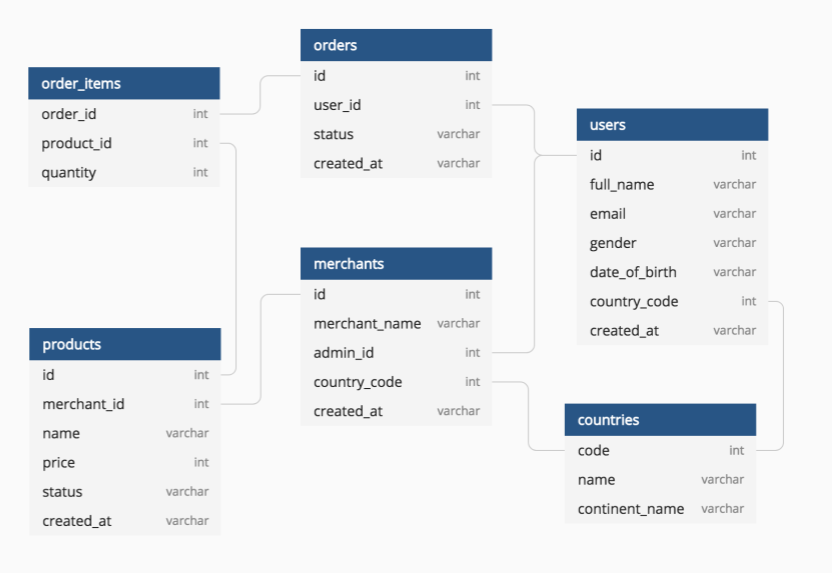
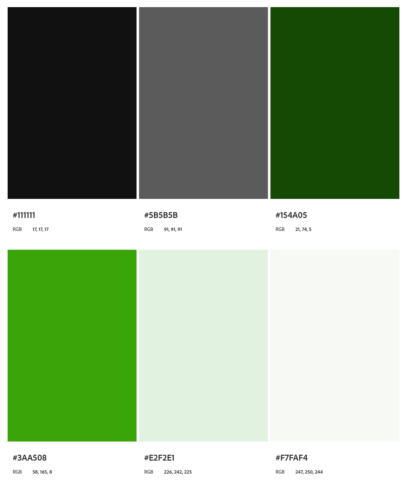
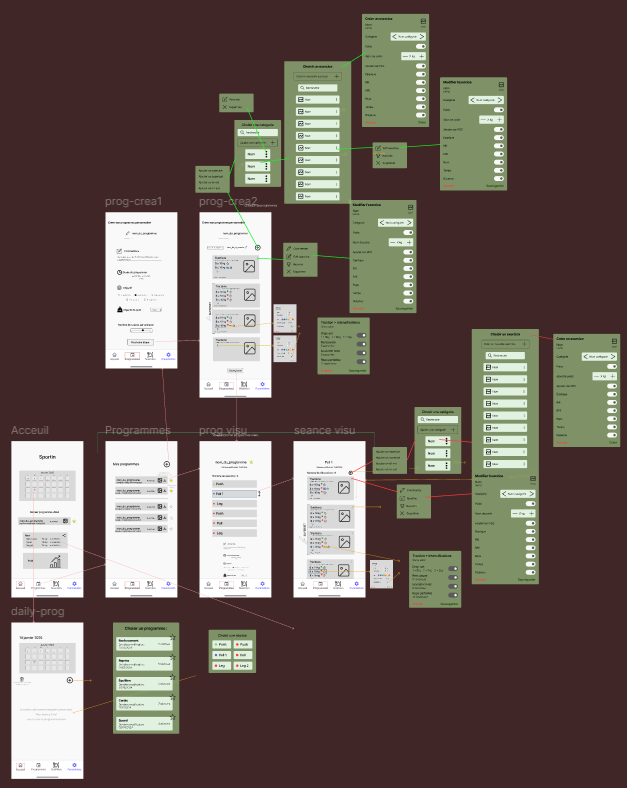
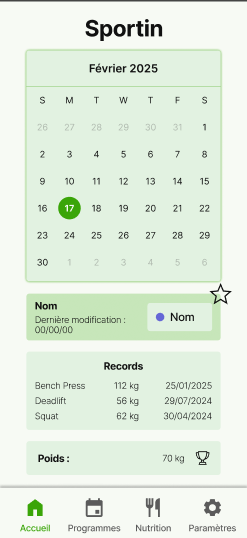

# SPORTIN - Train Smarter, Eat Better


## Langages et Technologies Utilisés  
| Langages et Technologies |  |
|------------|-------|
|  |  |
|  |  |
|  |  |
|  |  |
|  |   |

---

## Description du Projet

L'objectif principal de ce projet était de **développer une application mobile** en utilisant le **framework Flutter** de **Google**, tout en intégrant une **API préalablement construite** lors d'un cours précédent.

Nous avons choisi de créer **Sportin**, une application dédiée aux sportifs, visant à simplifier leur quotidien en leur offrant une plateforme complète pour :
- **Créer et personnaliser leurs programmes d'entraînement** ;
- **Élaborer un plan nutritionnel adapté à leurs besoins** ;
- **Suivre et analyser leurs progrès**.

Le concept de **Sportin** repose sur l'idée de **centraliser plusieurs outils** indispensables pour les sportifs dans une seule application, en combinant la gestion des **programmes**, de la **nutrition**, du **minuteur** et de la **musique**.

Un aspect clé de l'application était de **minimiser l'interaction avec le téléphone pendant les séances d'entraînement**. Ainsi, nous avons intégré **la reconnaissance vocale** pour permettre aux utilisateurs de contrôler la musique et les minuteurs sans avoir à toucher leur appareil.

**Sportin** vise à offrir une expérience fluide et intuitive, afin que les sportifs **puissent se concentrer pleinement sur leurs entraînements** tout en ayant accès à des outils pratiques et efficaces.

---

## Cahier des charges  
Cliquer pour le visualiser complètement :  
[](assets/sportin_cahier_des_charges.pdf)

---

## Organisation  

### Gestion de projet  
Utilisation de **Trello** pour suivre l'avancement des tâches et organiser le projet.  


---
### Gestion du code  
**Commits**  
Format pour les messages de commit :  
  ```
  <gitmoji>: commit message
 ```
  
**Branches**
| Branche       | Description                     |
|--------------|---------------------------------|
| `main`       | Code prêt pour la production    |
| `feat/{nom}` | Nouvelles fonctionnalités       |
| `fix/{nom}`  | Corrections de bugs            |

---

## Diagrame de la BDD
  


---

##  Charte Graphique  
**Charte graphique** de **Sportin**  

  
---

## Maquettage & Prototypage  
**Lien vers la maquette Figma :**  [Voir la maquette](https://www.figma.com/design/2aQ2tbswpGKv6Nj5kBrc6c/Sportin-Wireframe?node-id=102-226&t=umMUqsmLoXJFb6vB-1)  

**Vu d'ensemble** des maquettes de l'application  
  
  
**Page d'accueil** de l'application, vue sur Figma  


---

## Backend  
### API  
  

---

## Frontend  
Code : 
[github-sportin](https://github.com/remybms/sportin-app)  

  

